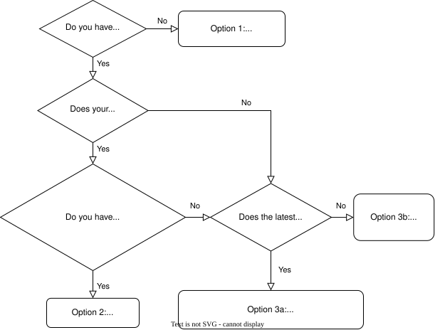

# Installing mumax⁺

mumax⁺ can be installed in various ways, listed as the various options below in order of increasing difficulty. The following flowchart may guide you to the easiest option for your situation.



## Option 1: Google Colab

If you don't have access to an NVIDIA GPU, you can run mumax⁺ online using Google Colab. Simply make a copy of [this Jupyter notebook](https://colab.research.google.com/github/mumax/plus/blob/master/examples/colab.ipynb) and you're good to go!

## Option 2: Installing a pre-built wheel

If you prefer to use your own GPU for more demanding simulations, you must install the mumax⁺ Python package. Pre-built wheels provide the easiest method to do so on Linux or Windows if your system has

- Python 3.11-3.14
- an NVIDIA GPU with Compute Capability &geq;5.2
- a CUDA driver of version &geq;550.54.15 on Linux or &geq;551.78 on Windows

If these requirements are fulfilled, the following command will automatically install mumax⁺ and its required dependencies in your active Python environment:

```bash
pip install mumaxplus -f https://github.com/mumax/plus/releases/expanded_assets/v1.2.1
```

> [!NOTE]
> Some optional dependencies of mumax⁺ (e.g., for 3D plotting) are not installed by default to preserve disk space. Replace `mumaxplus` in the command above by `mumaxplus[all]` to enable all functionality.

## Option 3: Installing from source

mumax⁺ should work on any NVIDIA GPU. If no wheel is available for your system/GPU (or you want to contribute to mumax⁺ development), you will have to install mumax⁺ from source.

For this, you must install the following tools yourself.
Take care to avoid **version conflicts** between these different types of software and your hardware: click the arrows for more details.

<details><summary>CUDA Toolkit</summary>

To see which CUDA Toolkit works for your GPU's Compute Capability, check [this Stack Overflow post](https://stackoverflow.com/questions/28932864/which-compute-capability-is-supported-by-which-cuda-versions).

* **Windows**: Download an installer from [the CUDA website](https://developer.nvidia.com/cuda-toolkit-archive).
* **Linux**: Use `sudo apt-get install nvidia-cuda-toolkit`, or [download an installer](https://developer.nvidia.com/cuda-toolkit-archive).

> ⚠️ Make especially sure that everything CUDA-related (like `nvcc`) can be found inside your PATH.
> On Linux, for instance, this can be done by editing your `~/.bashrc` file and adding the following lines:
>
> ```bash
> # add CUDA
> export PATH="/usr/local/cuda/bin:$PATH"
> export LD_LIBRARY_PATH="/usr/local/cuda/> lib64:$LD_LIBRARY_PATH"
> ```
>
> The paths may differ if the CUDA Toolkit was installed in a different location.

👉 *Check CUDA installation with: `nvcc --version`*

</details>

<details><summary>A C++ compiler which supports C++17</summary>

* **Linux:** `sudo apt-get install gcc`
  * ⚠️ Each CUDA version has a maximum supported `gcc` version, as listed in [this StackOverflow answer](https://stackoverflow.com/a/46380601). If necessary, use `sudo apt-get install gcc-<min_version>` instead, with the appropriate `<min_version>`.
* **Windows:** [Microsoft Visual C++](https://visualstudio.microsoft.com/downloads/) (MSVC) must be used, since CUDA does not support `gcc` on Windows.
  * ⚠️ Make sure you install a version of MSVC that is compatible with your installed CUDA toolkit, as listed in [this table](https://quasar.ugent.be/files/doc/cuda-msvc-compatibility.html) (e.g., MSVC 2026 does not yet seem to be supported by CUDA as of January 2026).
  * During installation, check the box to include the "Desktop development with C++" workload.
  * After installing, check if the path to `cl.exe` was added to your `PATH` environment variable (i.e., check whether `where cl.exe` returns an appropriate path like `C:\Program Files\Microsoft Visual Studio\2022\Community\VC\Tools\MSVC\14.29.30133\bin\HostX64\x64`). If not, add it manually.

👉 *Check C installation with: `gcc --version` on Linux and `where.exe cl.exe` on Windows.*

</details>

<details><summary>CPython <i>(version ≥ 3.11)</i>, pip and miniconda/anaconda</summary>

&nbsp;&nbsp;&nbsp;&nbsp;&nbsp;&nbsp;All these Python-related tools should be included in a standard installation of [Anaconda or Miniconda](https://www.anaconda.com/download/success).

👉 *Check installation with `python --version`, `pip --version` and `conda --version`.*

</details>

### Option 3a: Installing a stable release from PyPI

If you only need the latest stable version of mumax⁺, you should now be able to run

```bash
pip install mumaxplus
```

This will install any Python dependencies of mumax⁺ and build mumax⁺ from source.

> [!NOTE]
> Some optional dependencies of mumax⁺ (e.g., for 3D plotting) are not installed by default to preserve disk space. Use `pip install mumaxplus[all]` to enable all functionality.

### Option 3b: Installing a custom mumax⁺

If you need an older version of mumax⁺ or wish to contribute to its development, you will need Git.
Click the dropdown below to download Git if you haven't installed it yet.

<details><summary>Git</summary>

* **Windows:** [Download](https://git-scm.com/downloads) and install.
* **Linux:** `sudo apt install git`

👉 *Check Git installation with: `git --version`*

</details>

First, clone the mumax⁺ Git repository using the following command, where the `--recursive` flag is used to get the pybind11 submodule that is needed to build mumax⁺.

```bash
git clone --recursive https://github.com/mumax/plus.git mumaxplus
cd mumaxplus
```

We recommend to install mumax⁺ in a clean conda environment as follows. You could also skip this step and use your own conda environment instead if preferred.

<details><summary>Click to show tools automatically installed in the conda environment</summary>

* cmake 4.0.0
* Python 3.13
* pybind11 v2.13.6
* NumPy
* matplotlib
* SciPy
* Sphinx

</details>

```bash
conda env create -f environment.yml
conda activate mumaxplus
```

Finally, build and install mumax⁺ using pip.

```bash
pip install .
```

> [!TIP]
> If changes are made to the code, then `pip install -v .` can be used to rebuild mumax⁺, with the `-v` flag enabling verbose debug information.
>
> If you want to change only the Python code, without needing to reinstall after each change, `pip install -ve .` can also be used.

## Check your mumax⁺ installation

To check if you successfully compiled mumax⁺, we recommend you to run some [examples](README.md#examples) from the `examples/` directory
or to run the [tests](README.md#testing) in the `test/` directory.

<details><summary><h3>Troubleshooting</h3></summary>

* (*Windows*) If you encounter the error `No CUDA toolset found`, try copying the files in `NVIDIA GPU Computing Toolkit/CUDA/<version>/extras/visual_studio_integration/MSBuildExtensions` to `Microsoft Visual Studio/<year>/<edition>/MSBuild/Microsoft/VC/<version>/BuildCustomizations`. See [these instructions](https://github.com/NVlabs/tiny-cuda-nn/issues/164#issuecomment-1280749170) for more details.

* (*Windows*) If you encounter errors related to interactions between CMake, MSVC and CUDA, like `-- Detecting CUDA compiler ABI info - failed`, you may try the following methods to activate an appropriate set of environment variables. One option is to run the compilation commands in the "Developer Powershell for VS 20XX" that should have been automatically installed alongside MSVC. For CUDA &leq;12.9, another option is to call one of the `.bat` scripts in the folder `& C:\Program Files\Microsoft Visual Studio\2022\Community\VC\Auxiliary\Build`, such as `vcvars64.bat`, before you run `pip install`.

</details>
