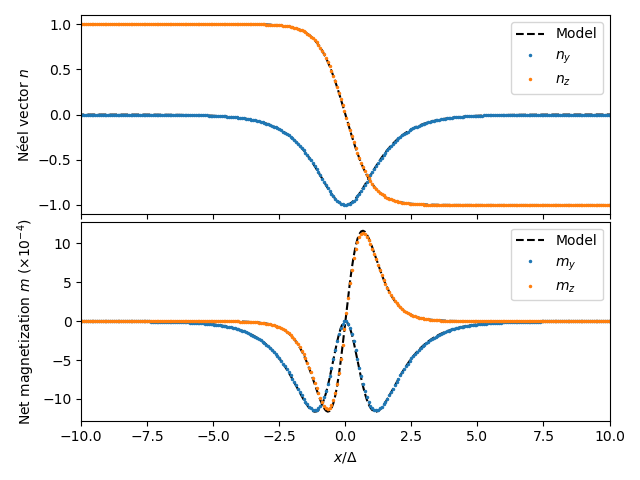

:nosearch:

Altermagnetic domain wall
=========================

In this example, we compute the Néel and net magnetization profiles of a Bloch
wall. The theoretical model is based on
`Gomonay et al. (2024) <https://www.nature.com/articles/s44306-024-00042-3>`_.

.. literalinclude:: ../../examples/Bloch_wall_altermagnet.py
  :language: python
  :lines: 5-

