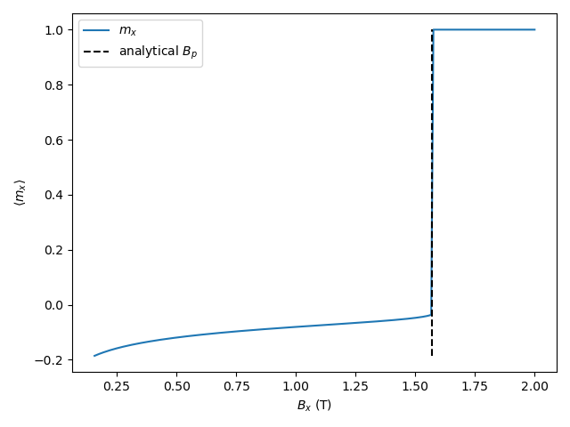

:nosearch:

Standard Problem: Domain Wall Pinning
=====================================

This script solves the `proposed micromagnetic standard problem about domain
wall pinning <https://doi.org/10.1016/j.jmmm.2021.168875>`_ at a boundary
between a soft and a hard magnetic phase, with an external magnetic field
pointing to the right. The question is at what magnetic field strength the
domain wall unpins and moves to the right.

The proposed solution uses time evolution (`run`) with a continuously increasing
field strength. The solution used here uses a series of steps of increasing
magnetic field strength, minimizing the energy at each step. This yields the
same pinning field, but faster.

.. literalinclude:: ../../examples/standardproblem_DW_pinning.py
  :language: python
  :lines: 15-

