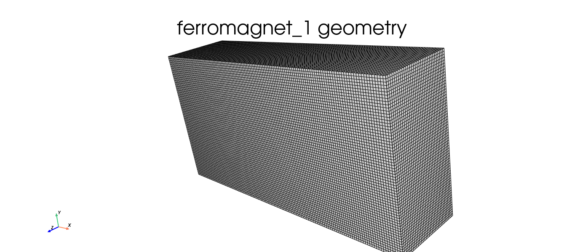
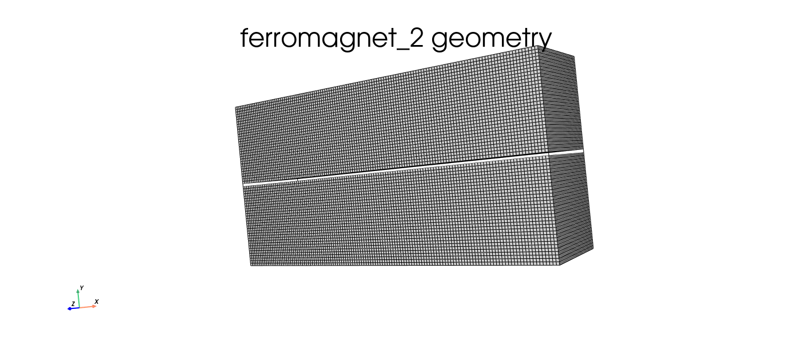
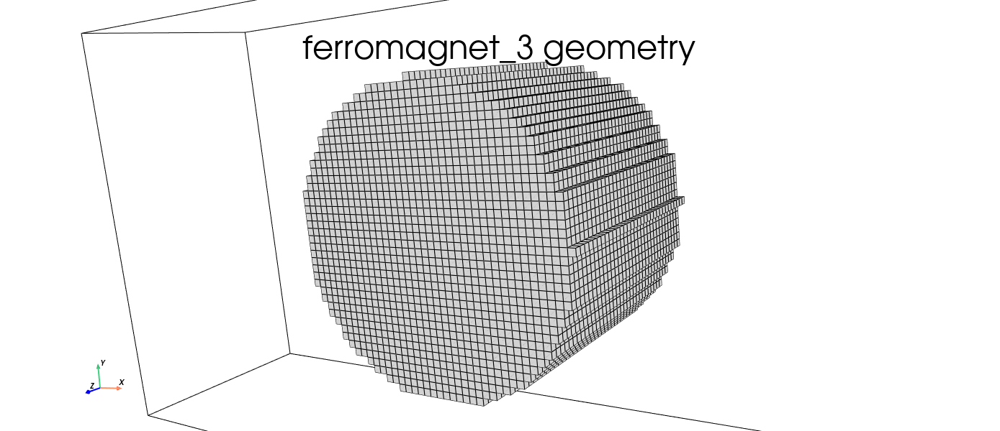
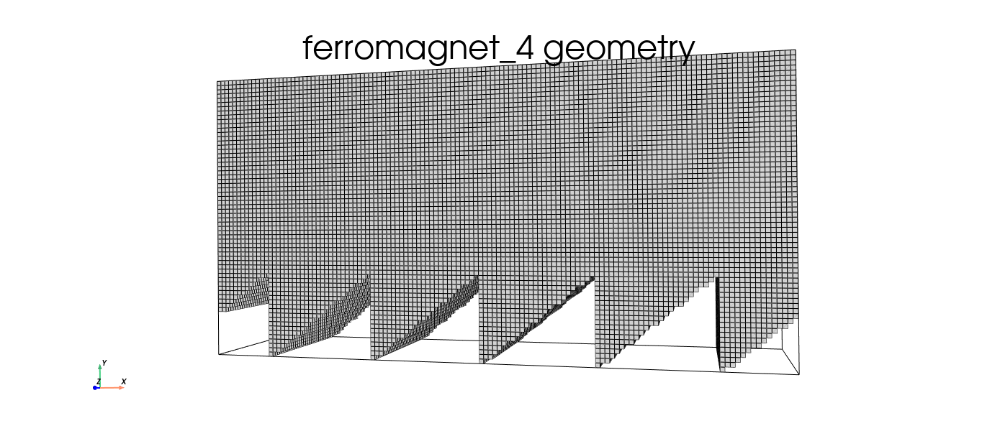
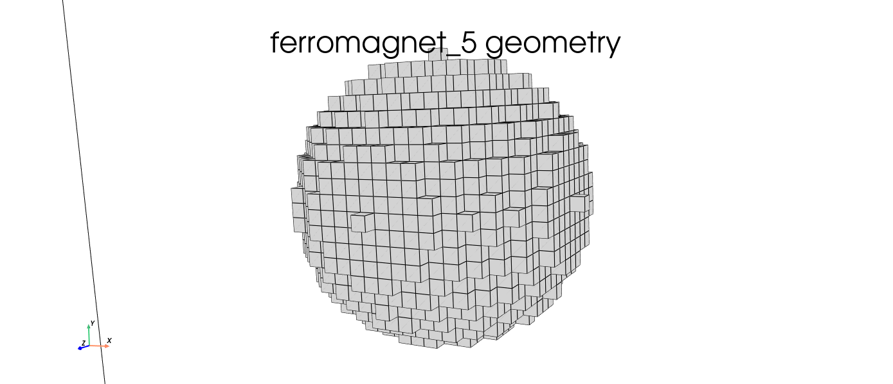

:nosearch:

Geometry
========

# Geometry
This tutorial will teach you how to set your geometry for your magnets. The `geometry` parameter can accept numpy arrays and functions.
We'll need some basic code to view the shapes. To pan around in the 3D PyVista plots, you might need to install some extra stuff (namely trame):

.. code-block:: console
    
    pip install ipywidgets 'pyvista[all,trame]'

.. code-block:: python

    import numpy as np
    from mumaxplus import Ferromagnet, Grid, World
    import mumaxplus.util.shape as shape
    from mumaxplus.util.show import show_magnet_geometry

We will first define the constants of our world and grid. The grid is comprised of 128 x 64 x 32 cells of each 1 x 1 x 1 nm³.

.. code-block:: python

    nx, ny, nz = 128, 64, 32
    cx, cy, cz = 1e-9, 1e-9, 1e-9

1. Numpy arrays
---------------
Here we will be looking at setting the geometry with a numpy array. The array should have the same dimensions as our grid and should contain booleans.

1.1 The full grid
^^^^^^^^^^^^^^^^^
If we want our magnet to be the entire grid we do not have to specify a geometry.

.. code-block:: python

    world = World(cellsize=(cx, cy, cz))
    grid  = Grid((nx, ny, nz))

    magnet = Ferromagnet(world=world, grid=grid)
    magnet.magnetization = (1,0,0)

    show_magnet_geometry(magnet)

1.2 Eliminating pixels
^^^^^^^^^^^^^^^^^^^^^^
If we want to remove some pixels from the magnet we can create an array as big as our grid and set some values to 0 (or `False`). Note that the array should have a shape of (nz, ny, nx).
Let's now remove a pixel at the center row of the magnet.

.. code-block:: python

    world = World(cellsize=(cx, cy, cz))
    grid  = Grid((nx, ny, nz))

    geom_array = np.ones(shape=(nz,ny,nx))
    geom_array[:,ny//2,:] = np.zeros(shape=(nz,nx))

    magnet = Ferromagnet(world=world, grid=grid, geometry=geom_array)
    magnet.magnetization = (1,0,0)

    show_magnet_geometry(magnet)

2. Functions
------------
We can also create our own functions to form geometries. The input of every function should be (x,y,z) where x, y and z are real space coordinates. The output of the function should be a boolean.

2.1 Circle
^^^^^^^^^^
Here we create a circle with a radius of 20nm at the center of the grid

.. code-block:: python

    world = World(cellsize=(cx, cy, cz))
    grid  = Grid((nx, ny, nz))

    geomfunc = lambda x, y, z: (x-nx*cx/2)**2 + (y-ny*cy/2)**2 < (20e-9)**2

    magnet = Ferromagnet(world=world, grid=grid, geometry=geomfunc)
    magnet.magnetization = (1,0,0)

    show_magnet_geometry(magnet)

2.2 Sawtooth
^^^^^^^^^^^^
Here we will cut a sawtooth pattern out of a magnet.

.. code-block:: python

    world = World(cellsize=(cx, cy, cz))
    grid  = Grid((nx, ny, nz))

    p = 25e-9
    a = 20e-9

    def saw(x,y,z):
        func = a*(x/p - np.floor(0.5 + x/p)) + a/2-cy
        return y > func

    magnet = Ferromagnet(world=world, grid=grid, geometry=saw)
    magnet.magnetization = (1,0,0)

    show_magnet_geometry(magnet)

3. Shapes
---------
Let's end this tutoial by using the `Shape` class to generate a geometry. For more information on different shapes and shape manipulations see `shape.ipynb`.

3.1 Sphere
^^^^^^^^^^
Here we create a spherical magnet with a diameter of 20nm

.. code-block:: python

    world = World(cellsize=(cx, cy, cz))
    grid  = Grid((nx, ny, nz))

    circ = shape.Sphere(diam=20e-9)
    circ.translate(nx*cx/2, ny*cy/2, nz*cz/2)
    magnet = Ferromagnet(world=world, grid=grid, geometry=circ)

    show_magnet_geometry(magnet)

