:nosearch:

The ``plot_field`` function
===========================

We will explore the functionality of the ``plot_field`` function, which is a part of the ``util`` package of ``mumaxplus``.
We will cover

- layers and axes
- inspecting components
- arrows
- color bars
- scalar and tensor fields
- numpy arrays
- further customization and bookkeeping

We will use standard problem 3 as a basis.
The Problem specification can be found on https://www.ctcms.nist.gov/~rdm/mumag.org.html.

.. code-block:: python

    import numpy as np
    import matplotlib.pyplot as plt

    from mumaxplus import Ferromagnet, Grid, World
    from mumaxplus.util.config import vortex
    from mumaxplus.util.formulary import exchange_length, magnetostatic_energy_density

    msat = 800e3
    aex = 13e-12
    alpha = 0.02
    ku1 = 0.1 * magnetostatic_energy_density(msat)
    anisU = (1, 0, 0)

    # close to cube size where vortex and flower states have equal energy
    length_in_lex = 8.46  # in unit of exchange length
    lex = exchange_length(aex, msat)
    length = length_in_lex * lex
    N = 32

    world = World(cellsize=(length / N, length / N, length / N))
    magnet = Ferromagnet(world, Grid((N, N, N)))

    magnet.msat = msat
    magnet.aex = aex
    magnet.ku1 = ku1
    magnet.anisU = anisU

    magnet.magnetization = (1, 0, 0.01)  # flower
    # magnet.magnetization = vortex(magnet.center, length / 12, -1, 1)  # vortex
    magnet.minimize()

    # make magnetization a shorter variable
    mag = magnet.magnetization

Layers and Axes
---------------

Let's call ``plot_field`` on the magnetization of the magnet.

.. code-block:: python

    from mumaxplus.util.show import plot_field

    plot_field(mag)

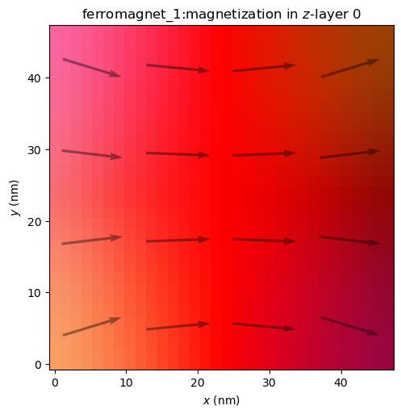

As explained by the title, this displays the magnetization in z-layer number 0, so the bottom layer, with the z-axis as the out-of-plane axis.
We can also look at a different layer.

.. code-block:: python

    plot_field(mag, layer=N-1)

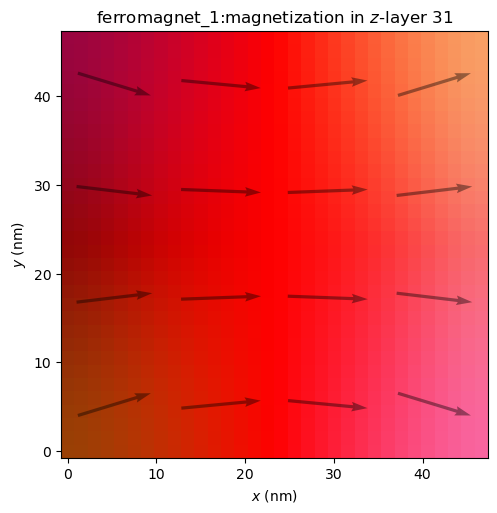

Or look along a different out-of-plane axis.

.. code-block:: python

    plot_field(mag, out_of_plane_axis="x")
    plot_field(mag, out_of_plane_axis="y")

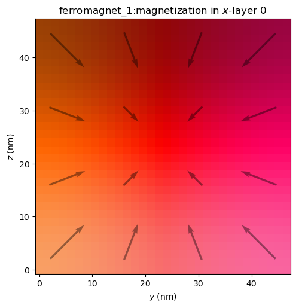

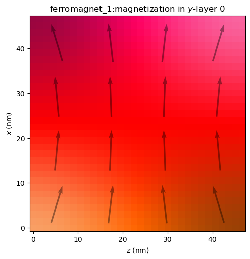

A few things to note:

- The arrows always lie in the plotting plane and are scaled according to the magnitude of their projection in that plane.
- The HSL color scheme is independent of the out-of-plane axis, where the x- and y-components always control the hue and saturation and the z-component controls lightness.
- The axes make a right-handed coordinate system, hence x is plotted vertically and z horizontally with y as the out-of-plane axis.

Combining these on a single figure can be more convenient. We'll make our own figure with multiple Axes, and pass each one to the ``ax`` argument.

.. code-block:: python

    fig, axs = plt.subplots(ncols=3, figsize=(15, 4.8))
    for i, OoP_axis in enumerate("zyx"):
        plot_field(mag, ax=axs[i], out_of_plane_axis=OoP_axis, layer=N//2)
    fig.suptitle("Magnetization seen along different out-of-plane axes")
    plt.show()

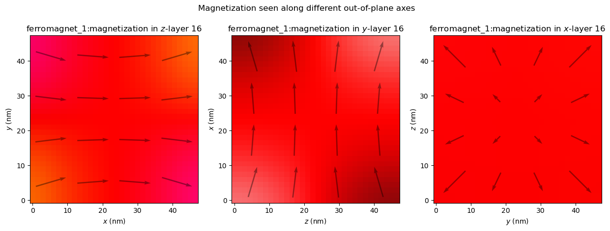

Inspecting Components
---------------------

It can also be useful to look at an individual component.

.. code-block:: python

    fig, axs = plt.subplots(ncols=3, figsize=(15, 4.2))
    for c in range(3):
        plot_field(mag, ax=axs[c], component=c)
    fig.suptitle("Different components of the magnetization.")
    fig.tight_layout()
    plt.show()

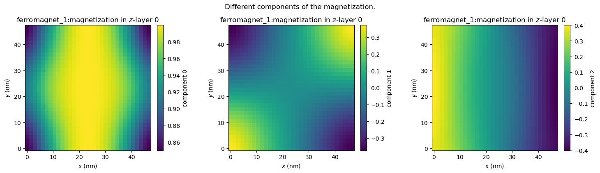

While this gives a clear overview, it could be useful to fix ``vmin`` and ``vmax`` to known values and perhaps change the colormap to a symmetric one like ``"PuOr"``. This can be done via the ``imshow_kwargs``.

.. code-block:: python

    plot_field(mag, component=2, imshow_kwargs={"vmin": -1, "vmax": 1, "cmap": "PuOr"})

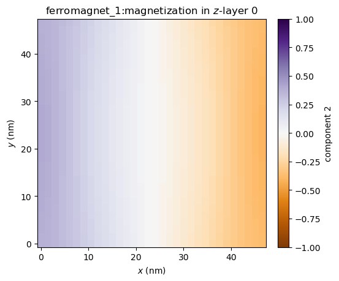

We may wish to keep the symmetric color limits, but let it figure out the limits itself. We can set ``imshow_symmetric_clim`` to ``True``, without specifying ``vmin`` or ``vmax``. We also don't have to specify the colormap in this case (although we still can), because ``"bwr"`` will automatically be used.

.. code-block:: python

    plot_field(mag, component=2, imshow_symmetric_clim=True)

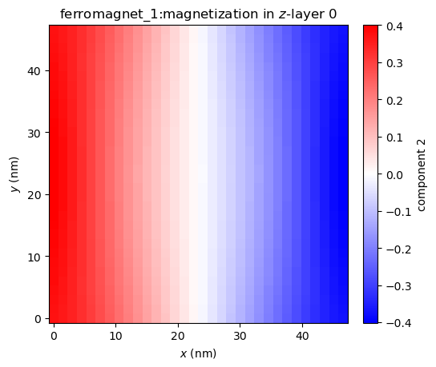

Inspecting all field components at once is a fairly common action, so ``inspect_field`` is a function that does just that. It has most of the same functionality as ``plot_field``, except for drawing arrows. Via ``shared_colorbar``, we can set the color bar of the different components to be shared too.

.. code-block:: python

    from mumaxplus.util.show import inspect_field

    inspect_field(mag, shared_colorbar=True, symmetric_clim=True)

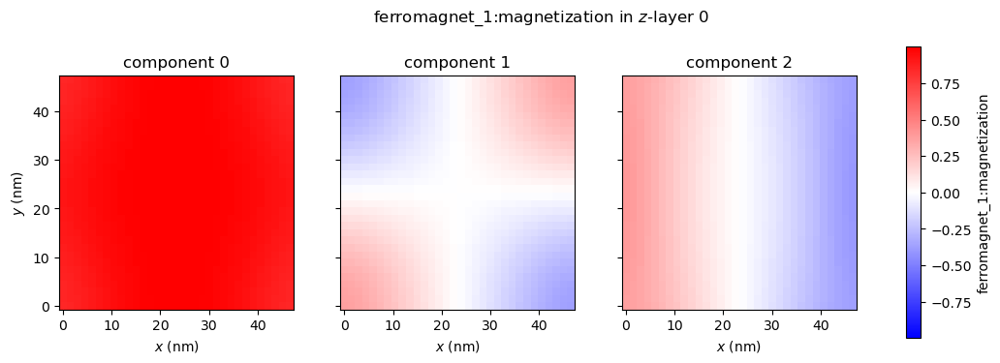

Arrows
------

.. code-block:: python

    # Change the state to a vortex state to make it more interesting
    magnet.magnetization = vortex(magnet.center, length / 12, -1, 1)
    magnet.minimize()

We can change the size of the arrows (in number of cells). A smaller arrow_size yields more total arrows.

.. code-block:: python

    plot_field(mag, arrow_size=2)

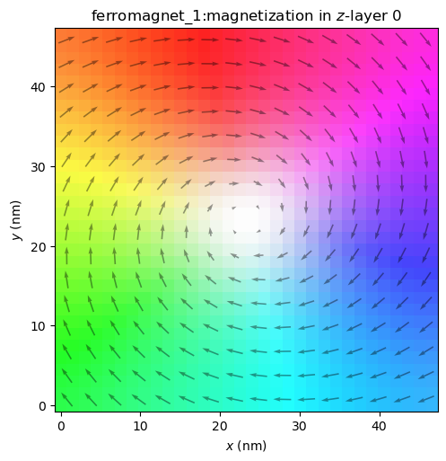

Or we can disable the arrows altogether.

.. code-block:: python

    plot_field(mag, enable_quiver=False)

The arrows are automatically disabled when looking at only one component, but when plotting vector fields we can enable them again.

.. code-block:: python

    plot_field(mag, component=0, enable_quiver=True, arrow_size=2)

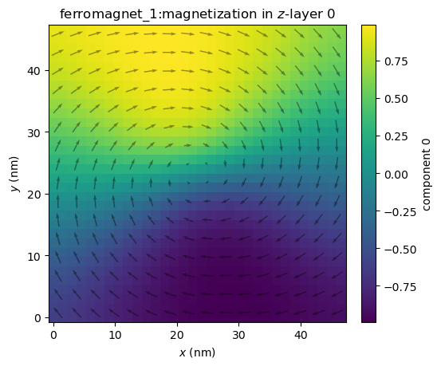

It might be hard to see, so we can change the color of the arrows, the alpha value, shape of the arrows, etc. via ``quiver_kwargs``.

.. code-block:: python

    plot_field(mag, component=2, enable_quiver=True, arrow_size=2, quiver_kwargs={"color": "red", "alpha": 1.0})

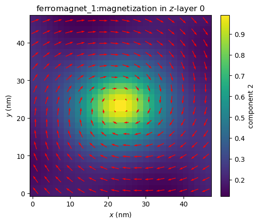

We can also color the arrows with the same HSL color scheme by setting ``quiver_cmap`` to ``"HSL"``.

.. code-block:: python

    plot_field(mag, component=2, enable_quiver=True, arrow_size=2, quiver_cmap="HSL")

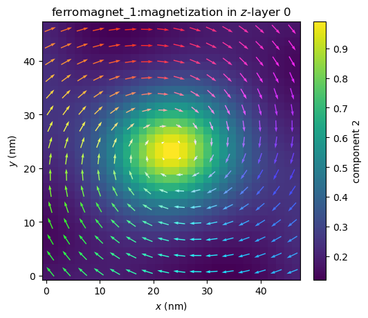

Or this can be set to any matplotlib colormap, which will show the out-of-plane component. Just like before, we can control symmetrization of the color limits with ``quiver_symmetric_clim``.

.. code-block:: python

    ax = plot_field(mag, component=0, enable_quiver=True, arrow_size=2, quiver_cmap="Grays_r")

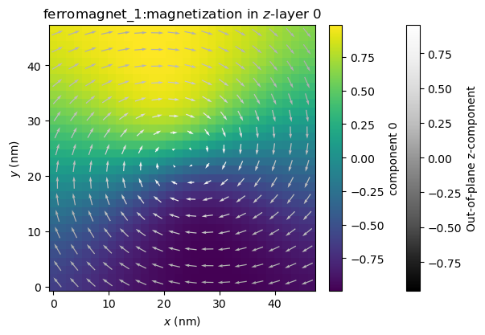

Color Bars
----------

Like with the arrows, we can disable the color bar with ``enable_colorbar = False``. We can also fully customize the color bar via ``colorbar_kwargs``.

.. code-block:: python

    plot_field(mag, component=0, imshow_symmetric_clim=True, colorbar_kwargs={"ticks": [-0.5, 0, 0.5], "orientation" : "horizontal", "label": "$m_x$"})

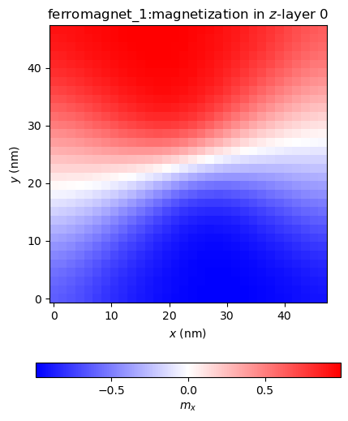

Scalar and Tensor Fields
------------------------

``plot_field`` and ``inspect_field`` also work with fields with more or less than 3 components, although without the arrows.

.. code-block:: python

    # plotting all energy density components on one figure
    fig, axs = plt.subplots(ncols=3, figsize=(12, 3.5))
    fig.suptitle("Energy densities")
    for i, E in enumerate([magnet.exchange_energy_density, magnet.anisotropy_energy_density, magnet.demag_energy_density]):
        plot_field(E, ax=axs[i], layer=N//2)
    fig.tight_layout()
    plt.show()

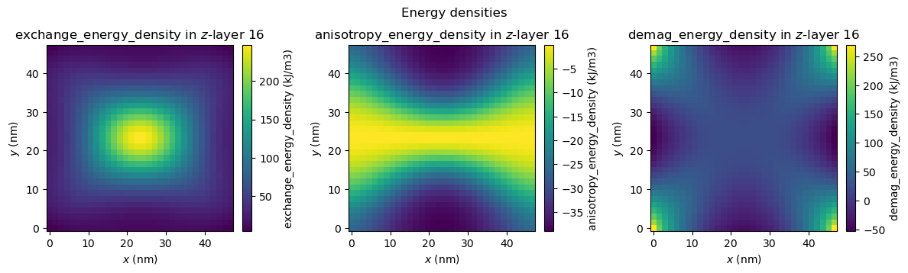

.. code-block:: python

    # parameters for illustrative purposes
    magnet.conductivity = 2.5e6
    magnet.amr_ratio = 0.02
    inspect_field(magnet.conductivity_tensor);

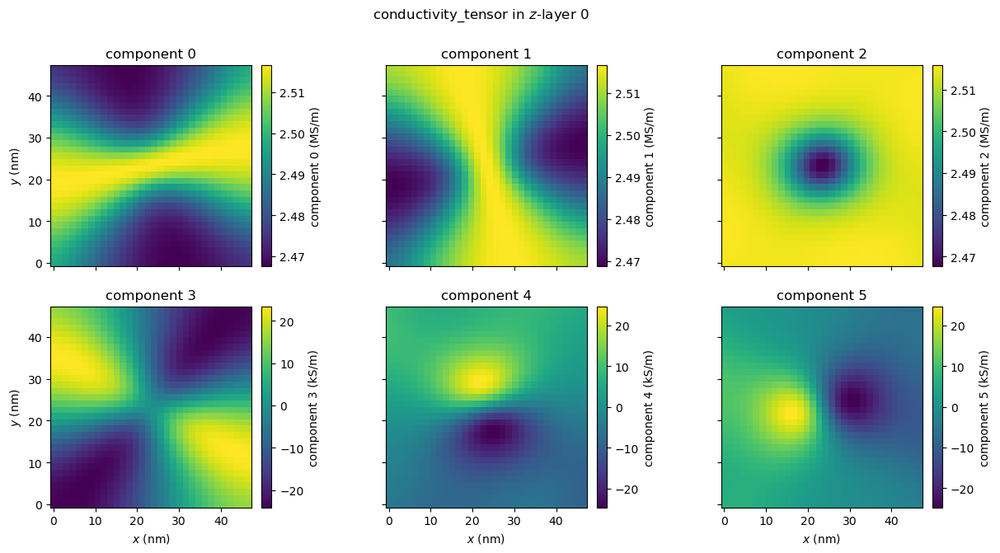

Numpy Arrays
------------

We can't only plot ``FieldQuantity`` instances of ``mumaxplus``, but also ``numpy.ndarray`` s. This can be useful when working with custom calculations, saved fields or manipulated quantities. Just pass the array as the first argument. The only requirement is that it has the same shape as a ``FieldQuantity``, meaning components first, then z, y and x indices.

.. code-block:: python

    magnet.magnetization = vortex(magnet.center, length / 12, -1, 1)  # vortex
    m_initial = magnet.magnetization.eval()
    magnet.minimize()
    m_minimized = magnet.magnetization.eval()

    # our custom calculation
    m_diff = m_minimized - m_initial

    plot_field(m_diff, arrow_size=2, layer=N//2)

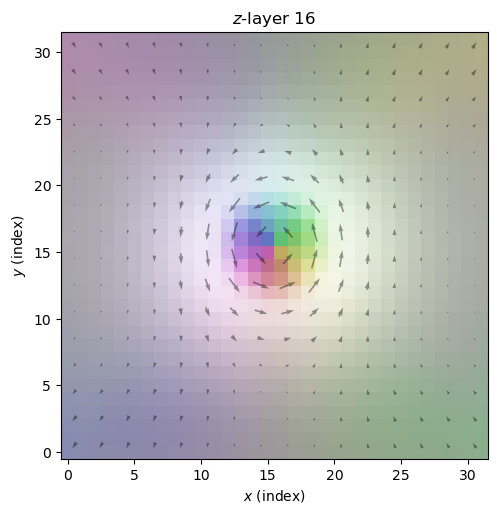

As you can see, we lose some information by using arrays. The ``plot_field`` function no longer has information about cell sizes, the name of the quantity, units, geometry, etc. We could customize the plot ourselves (see the last section), but we can also pass an appropriate quantity first and pass the field array we actually want to plot via the ``field`` argument.
This can also be used if you want to call ``plot_field`` multiple times on the same field without always reevaluating that field.
Let's set the title to be more appropriate though.

.. code-block:: python

    plot_field(mag, field=m_diff, arrow_size=2, layer=N//2, title=f"Magnetization difference in $z$-layer {N//2}\nbetween initial and minimized states")

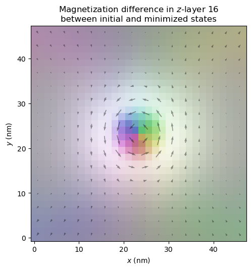

If you do want to set a geometry explicitly, you can do that via the ``geometry`` argument.

Further Customization and Bookkeeping
-------------------------------------

Lastly, we can customize the plot by passing ``figsize``, ``title``, ``xlabel`` and ``ylabel``, along with the various keyword argument dictionaries as seen before. We can pass ``ax`` to integrate the plot within our own, and ``plot_field`` returns the (created) Axes, so we can customize it further afterwards. If we do or do not want to show the figure when plotting, we can change the ``show`` argument. We can easily save it by passing a ``file_name``.

.. code-block:: python
    
    from mumaxplus.util.constants import MU0

    # make a magnet with exchange length and magnetostatic energy set to 1
    # as specified in the original problem statement
    cs = length_in_lex / N
    rescaled_world = World((cs, cs, cs))
    rescaled_magnet = Ferromagnet(rescaled_world, Grid((N, N, N)))

    rescaled_magnet.msat = np.sqrt(2/MU0)  # so Km = 1/2 µ0 Msat² = 1
    rescaled_magnet.aex = 1.0  # so l_ex = sqrt(aex / Km) = 1
    rescaled_magnet.ku1 = 0.1  # 0.1 * Km as specified
    rescaled_magnet.anisU = (1, 0, 0)

    rescaled_magnet.magnetization = vortex(rescaled_magnet.center, length_in_lex / 12, -1, 1)  # vortex
    rescaled_magnet.minimize()

    ax = plot_field(rescaled_magnet.magnetization, layer=N//2, arrow_size=4,
                    xlabel=r"$x$ ($l_{\rm ex}$)", ylabel=r"$y$ ($l_{\rm ex}$)",
                    figsize=(3,3), title="Magnetization in\nrescaled magnet", show=False)

    center = rescaled_magnet.center[0:2]
    ax.scatter(*center)
    ax.annotate("Center", center, np.array(center) + np.array([-2 * cs, 7 * cs]), arrowprops=dict(facecolor='black', shrink=0.05))

    plt.show()

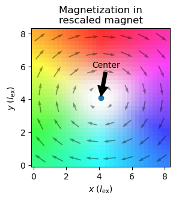
