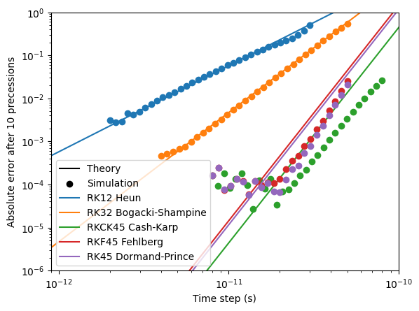
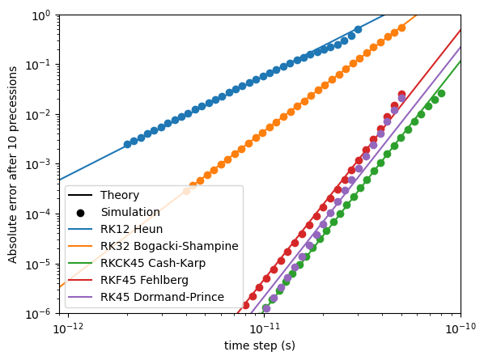

:nosearch:

Single and double floating-point precision
==========================================

mumax⁺ can use either single (32-bit) or double (64-bit) floating-point precision.

By default, single precision is used.

Choosing a precision
--------------------

The choice of floating-point precision affects all of mumax⁺, and must therefore be made **before** the line

.. code-block:: python

    import mumaxplus

is reached.
Two switches determine which precision will then be loaded, as listed below in descending order of priority.
Both accept the values ``SINGLE``/``1``/``32`` for single precision and ``DOUBLE``/``2``/``64`` for double precision.

- **The** ``--mumaxplus-fp-precision`` **command-line flag.** Example:
  
  .. code-block:: shell
    
    python some_mumax_script.py --mumaxplus-fp-precision DOUBLE

- **The** ``MUMAXPLUS_FP_PRECISION`` **environment variable.**
  If set globally on your system, this will also affect the compilation process, as explained below.
  It can also be set locally inside a single Python script by writing

  .. code-block:: python
    
    import os
    os.environ["MUMAXPLUS_FP_PRECISION"] = "DOUBLE"

  **before** the ``import mumaxplus`` statement.

The precision ultimately used by mumax⁺ can be accessed as ``mumaxplus.FP_PRECISION``, which will be either ``"SINGLE"`` or ``"DOUBLE"``.

Compilation
^^^^^^^^^^^

Compiling mumax⁺ normally results in two binaries: one for single and one for double precision.
However, if the environment variable ``MUMAXPLUS_FP_PRECISION`` is set, only one binary will be produced, corresponding to the desired precision.
This can be useful to reduce compile time during development, if only one precision is needed.

Possible errors
----------------

- Using ``MUMAXPLUS_FP_PRECISION`` to compile the source code for only one floating-point precision, and then asking for the opposite precision with ``--mumaxplus-fp-precision`` when running a script, will result in a ``ModuleNotFoundError``.

- Since the choice of precision must be made before the ``import mumaxplus`` statement, it is not possible to use single precision in one part of a script and double precision in another: these must be run in separate processes. Reloading mumax⁺ with a different floating-point precision during runtime may lead to a vast wealth of errors.

Example: error floor
--------------------

The floating-point precision used has a significant impact on the error floor.

Below, we compare the numerical and analytical result of 10 precessions of one spin in an external magnetic field of 0.1 T, with damping. Depending on the time step, this results in a different error. The minimum attainable error is dependent on the floating-point precision used.

.. dropdown:: Show code

    .. code-block:: python
        
        import os
        os.environ["MUMAXPLUS_FP_PRECISION"] = "SINGLE"

        import matplotlib.pyplot as plt
        import numpy as np
        from math import acos, atan, pi, exp, tan, sin, cos, sqrt

        from mumaxplus import *
        from mumaxplus.util import *

        def magnetic_moment_precession(time, initial_magnetization, hfield_z, damping):
            """Return the analytical solution of the LLG equation for a single magnetic
            moment and an applied field along the z direction.
            """
            mx, my, mz = initial_magnetization
            theta0 = acos(mz)
            phi0 = atan(my / mx)
            freq = GAMMALL_DEFAULT * hfield_z / (1 + damping ** 2)
            phi = phi0 + freq * time
            theta = pi - 2 * atan(exp(damping * freq * time) * tan(pi / 2 - theta0 / 2))
            return np.array([sin(theta) * cos(phi), sin(theta) * sin(phi), cos(theta)])

        def single_system(method, dt):
            """This function simulates a single spin in a magnetic field of 0.1 T without damping.

            Returns the absolute error between the simulation and the exact solution.

            Parameters:
            method -- The used simulation method
            dt     -- The time step
            """
            # --- Setup ---
            world = World(cellsize=(1e-9, 1e-9, 1e-9))
            
            magnetization = (1/np.sqrt(2), 0, 1/np.sqrt(2))
            damping = 0.001
            hfield_z = 0.1  # External field strength
            duration = 2*np.pi/(GAMMALL_DEFAULT * hfield_z) * (1 + damping**2) * 10  # Time of 10 precessions

            magnet = Ferromagnet(world, grid=Grid((1, 1, 1)))
            magnet.enable_demag = False
            magnet.magnetization = magnetization
            magnet.alpha = damping
            magnet.aex = 10e-12
            magnet.msat = 1/MU0
            world.bias_magnetic_field = (0, 0, hfield_z)

            # --- Run the simulation ---
            world.timesolver.set_method(method)
            world.timesolver.adaptive_timestep = False
            world.timesolver.timestep = dt
            
            world.timesolver.run(duration)
            output = magnet.magnetization.average()

            # --- Compare with exact solution ---
            exact = magnetic_moment_precession(duration, magnetization, hfield_z, damping)
            error = np.linalg.norm(exact - output)

            return error

        method_names = ["Heun", "BogackiShampine", "CashKarp", "Fehlberg", "DormandPrince"]
        exact_names = ["Heun", "Bogacki-Shampine", "Cash-Karp", "Fehlberg", "Dormand-Prince"]
        RK_names = ["RK12", "RK32", "RKCK45", "RKF45", "RK45"]
        exact_order = [2, 3, 5, 5, 5]
        dts_lower = [2e-12, 4e-12, 8e-12, 8e-12, 8e-12] # Lower bounds for the time steps
        dts_upper = [3e-11, 5e-11, 8e-11, 5e-11, 5e-11] # Upper bounds for the time steps

        N_dens = 30  # Amount of datapoints between two powers of 10
        dts = [np.logspace(np.log10(dts_lower[i]), np.log10(dts_upper[i]), int(N_dens*(np.log10(dts_upper[i]) - np.log10(dts_lower[i])))) for i, _ in enumerate(method_names)] # Time step arrays

        # --- Plotting ---
        plt.xscale('log')
        plt.yscale('log')
        plt.xlim((0.9e-12, 1e-10))
        plt.ylim((1e-6, 1))
        plt.xlabel("Time step (s)")
        plt.ylabel("Absolute error after 10 precessions")

        plt.plot([], [], color="black", label="Theory")  # Labels for theoretical results
        plt.scatter([], [], marker="o", color="black", label="Simulation")  # Labels for simulated results

        # --- Simulation Loops ---
        orders = {}
        for i, method in enumerate(method_names):
            error = np.zeros(shape=dts[i].shape)
            for j, dt in enumerate(dts[i]):
                err = single_system(method, dt)
                error[j] = err
            
            # Find the order
            log_dts, log_error = np.log10(dts[i]), np.log10(error)
            order = np.polyfit(log_dts, log_error, 1)[0]
            orders[exact_names[i]] = order

            plt.scatter(dts[i], error, marker="o", zorder=2)

            intercept = np.polyfit(log_dts, log_error - log_dts * exact_order[i], 0)
            plt.plot(np.array([1e-14, 1e-9]), (10**intercept)*np.array([1e-14, 1e-9])**exact_order[i], label=f"{RK_names[i]} {exact_names[i]}")

        plt.legend()
        plt.show()

With ``SINGLE`` precision, the error floor after 10 precessions is around :math:`10^{-4}`:

|

With ``DOUBLE`` precision, however, the error floor reaches much lower:

